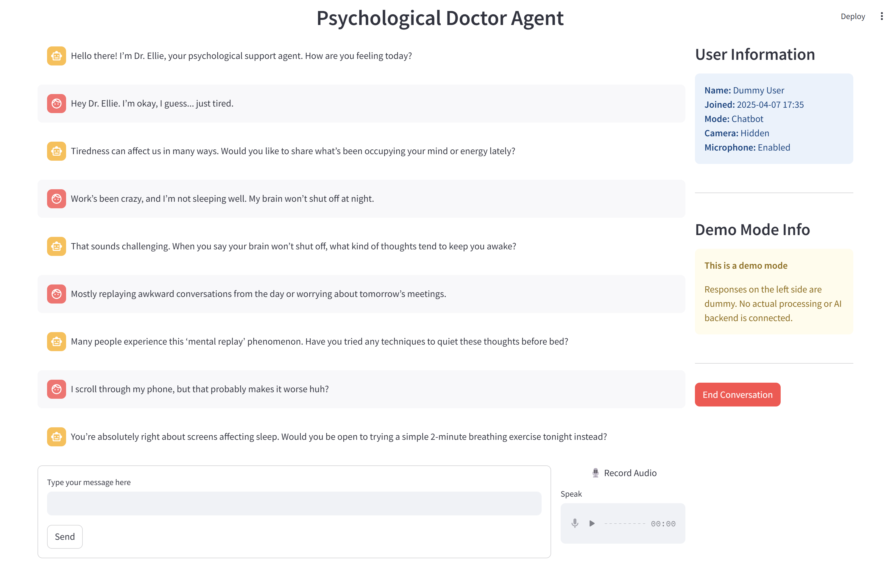

# Conversational Agents

This repository contains the group project for the TU Delft DSAIT4065 (previously CS4270) Conversational Agents course. The project implements a psychological doctor agent system powered by conversational AI technologies.

## Table of Contents

- [Conversational Agents](#conversational-agents)
  - [Table of Contents](#table-of-contents)
  - [1. Prerequisites](#1-prerequisites)
  - [2. System Interface](#2-system-interface)
  - [3. Setup Instructions](#3-setup-instructions)
    - [3.1 Environment Variables Setup](#31-environment-variables-setup)
    - [3.2 Facial Emotion Detection Setup](#32-facial-emotion-detection-setup)
      - [3.2.1 Option 1: Using venv](#321-option-1-using-venv)
      - [3.2.2 Option 2: Using Conda](#322-option-2-using-conda)
    - [3.3 Docker Deployment](#33-docker-deployment)
  - [4. Administration](#4-administration)
    - [4.1 MongoDB Management](#41-mongodb-management)
  - [5. Troubleshooting](#5-troubleshooting)
    - [5.1 Docker Commands](#51-docker-commands)

## 1. Prerequisites

- **Docker and Docker Compose**
- **Python 3.10 or higher** (for local deployment)
- **OpenAI API key** (for conversation capabilities)

## 2. System Interface

The psychological doctor agent features a [Streamlit-based](https://github.com/streamlit/streamlit) web interface that provides the following functionality:

- User registration and login system
- Text-based conversation with the agent
- Audio input capability via microphone
- Real-time facial emotion detection (Not shown in the demo figure below) 
- Text-to-speech response playback

Below is a screenshot of the user interface:



## 3. Setup Instructions

### 3.1 Environment Variables Setup

Create a `.env` file in the `./conversation` directory based on the provided `./conversation/.env.default` template.

### 3.2 Facial Emotion Detection Setup

> **Note:** Since camera access is challenging within Docker containers, this service runs ***locally*** with Docker mapping localhost to internal container hosts through `extra_hosts`.

To set up the facial emotion detection component, follow one of the options below:

#### 3.2.1 Option 1: Using venv

1. Create a Python virtual environment:

   ```bash
   python -m venv venv
   ```

2. Activate the virtual environment:

   - **For Windows:**

     ```bash
     venv\Scripts\activate
     ```

   - **For macOS/Linux:**

     ```bash
     source venv/bin/activate
     ```

3. Install the required dependencies:

   ```bash
   pip install -r deepface/requirements.txt
   ```

4. Run the facial emotion detection service:

   ```bash
   python deepface/app.py
   ```

#### 3.2.2 Option 2: Using Conda

1. Create a Conda environment with Python 3.10:

   ```bash
   conda create -n emotion_detection python=3.10
   conda activate emotion_detection
   ```

2. Install the required dependencies:

   ```bash
   pip install -r deepface/requirements.txt
   ```

3. Run the facial emotion detection service:

   ```bash
   python deepface/app.py
   ```

### 3.3 Docker Deployment

1. Start all services (MongoDB and conversation) using Docker Compose:

   ```bash
   docker-compose up -d
   ```

   To rebuild images when changes are made:

   ```bash
   docker-compose up -d --build
   ```

2. Once deployed, access the Streamlit conversation interface at: [http://localhost:8501](http://localhost:8501)

## 4. Administration

### 4.1 MongoDB Management

1. Connect to the MongoDB database:

   ```bash
   docker exec -it mongo mongosh -u admin -p password --authenticationDatabase admin
   ```

2. View conversation data:

   ```bash
   use conversations
   db.users.find().pretty()
   ```

## 5. Troubleshooting

### 5.1 Docker Commands

Common Docker commands for troubleshooting:

- Access container shell:

  ```bash
  docker exec -it <container_id_or_name> /bin/bash
  ```

- View container logs:

  ```bash
  docker logs <container_id_or_name>
  ```

- Restart services:

  ```bash
  docker-compose restart
  ```

- View logs for all services:

  ```bash
  docker-compose logs -f
  ```

- View logs for a specific service:

  ```bash
  docker-compose logs -f <service_name>
  ```